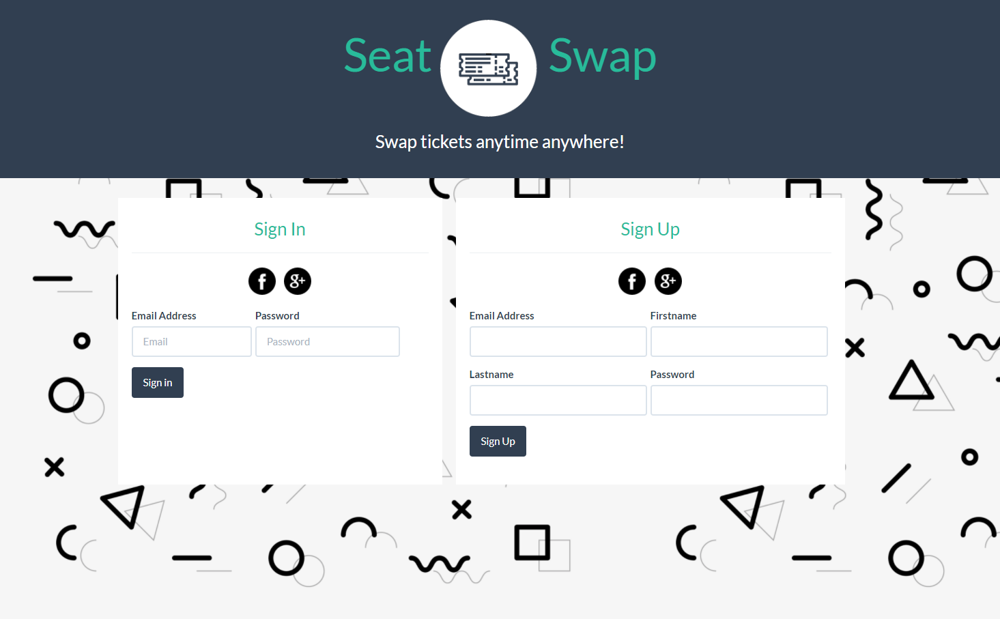
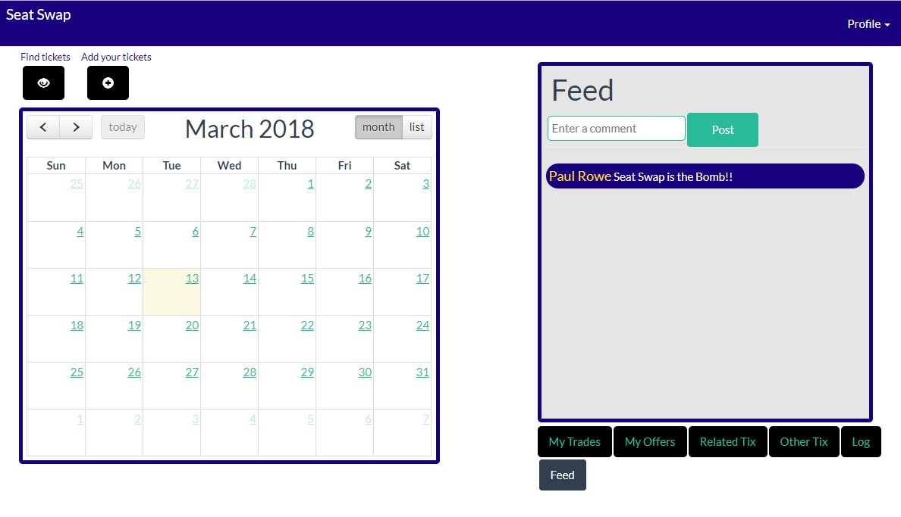

# SeatSwap

SeatSwap is a simple service that matches up ticket subscriber’s needs and facilitates painless swaps.

Arts and Sports organizations are finding it harder and harder to acquire and retain subscribers.  New audiences are less willing to commit to traditional season subscription models.  One part of the solution is to remove the prospective subscriber’s perceived risk of commitment.  

A service that helps subscribers exchange tickets with one another in a frictionless way could benefit both the subscriber and the organization.  These exchanges might be different dates to the same event, to different events at the same venue, or events at different venues on different dates.



## Get Started

SeatSwap is deployed on Heroku at: http://glacial-shelf-30321.herokuapp.com/.  

Upon landing, a user is presented with options to create an account or log in.  Either of these steps can be performed by either providing a user name and password, of using a social login.  FaceBook and Google+ are the two methods of social login available.

After login, the user is presented with the home page:



### Calendar

The left-hand panel, the calendar, offers visualization of subscription tickets the user has entered into SeaSwap. The calendar view can be toggled between grid and list views.  The calender helps users manage their subscriptions.

### Feeds 

The right-hand panel, feeds, provides  input forms or reverse-chron listings to facilitate trading and to encourage community envolvement.

## Installation       

To run locally for development purposes, clone down the repo, add your social authentication keys, connect your mysql server, run npm install, and then start server.js.  

### Prerequisites

Seat Swap was built and tested with NodeJS v9.3.0, MySQL 5.7.20, and the following NPM packages:

| NPM Package     | Version |
| --------------- | ------- |
| bcrypt-nodejs   | 0.0.3   |
| body-parser     | 1.18.2  |
| cookie-parser   | 1.4.3   |
| dotenv          | 5.0.1   |
| express         | 4.16.2  |
| express-handlebars | 3.0.0 |
| express-session | 1.15.6  |
| mysql           | 2.15.0  |
| mysql2          | 1.5.2   |
| node-rest-client | 3.1.0  |
| passport        | 0.4.0   |
| passport-facebook | 2.1.1 |
| passport-google-oauth20 | 1.0.0 |
| passport-local | 1.0.0 |
| passport-twitter | 1.0.4 |
| path           | 0.12.7 |
| sequelize | 4.35.2 |

You will need access tokens for Facebook, and Google to use social authentication.

You will need to install mySQL (preferably V5.7 or later).  You will want to set a password when you install it. 


### Installing

1. Clone the repo to your system.

1. Run `npm install`

1. Create a file named `.env`, add the following to it, replacing the values with your API keys (no quotes).  For LOCALDB_URL, replace the `[xyz]` with appropriate values.

```
#Google API keys

GOOGLE_CLIENT_ID=103457873105-EdupXFWRNjNFa8T2pFZeVXEgAzZhe6Xnqs.apps.googleusercontent.com
GOOGLE_CLIENT_SECRET=HAkklM177zw-93Mnku2LNRE3JP

# Facebook API keys

FACEBOOK_APP_ID=8135974561357843
FACEBOOK_APP_SECRET=8751b638f915437982a06f89f0d813492

# SQL Credentials

LOCALDB_URL=mysql://[user]:[pass]@[sqldomain]/[db name]

```

#### Google+ API

To obtain Google+ API keys: 

1. Go to google developer console: https://console.developers.google.com/projectselector/apis/library
1. Press create a project
1. Enable api (enable Google+ API)
1. Go to credentials
1. Create credentials: oAuth client id
1. Authorized JavaScript origins: http://localhost:3000
1. Authorized redirect URIs: http://localhost:3000/auth/google/callback


#### FaceBook

1. Go to FaceBook developers site: https://developers.facebook.com/
1. Go to FaceBook developer and create an app
1. Then add facebook login
1. After several UI steps, get the app id and secret at settings page
1. Finally,go to FaceBook login on the left, then settings to add: 
1. Authorized redirect URIs: http://localhost:3000/auth/facebook/callback

#### MySQL Database

The database must be created prior to starting the server.  Default database name is: `seatswap_db`.  There is a [seed file](testing/seed.sql) in this project repo that is useful to load into the database for test purposes.

## Technology

- [AJAX](https://en.wikipedia.org/wiki/Ajax_(programming)) 
- HTML, CSS, and [Bootstrap (version 4)](https://getbootstrap.com/docs/4.0/getting-started/introduction/)
- JavaScript and [jQuery](https://jquery.com/)
- [Express](https://www.npmjs.com/package/express)
- [Sequalize](https://www.npmjs.com/package/sequelize)
- [Passport](https://www.npmjs.com/package/passport)
- [FullCalendar](https://www.npmjs.com/package/fullcalendar)

## Contributors

- [Elena Doncheva](https://github.com/Leyni30)
- [Joyce Sau Ngan Lam](https://github.com/joyce-lam)
- [Sasha Patsel](https://github.com/SashaPatsel)
- [Paul Rowe](https://github.com/zrowe)


## Acknowledgments

- Many thanks to Amber Burroughs, Abraham Ferguson, and Dani Roxberry for their feedback, guidance, and review.